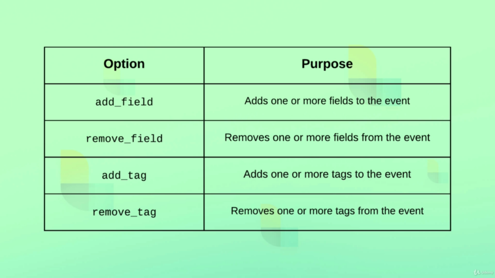
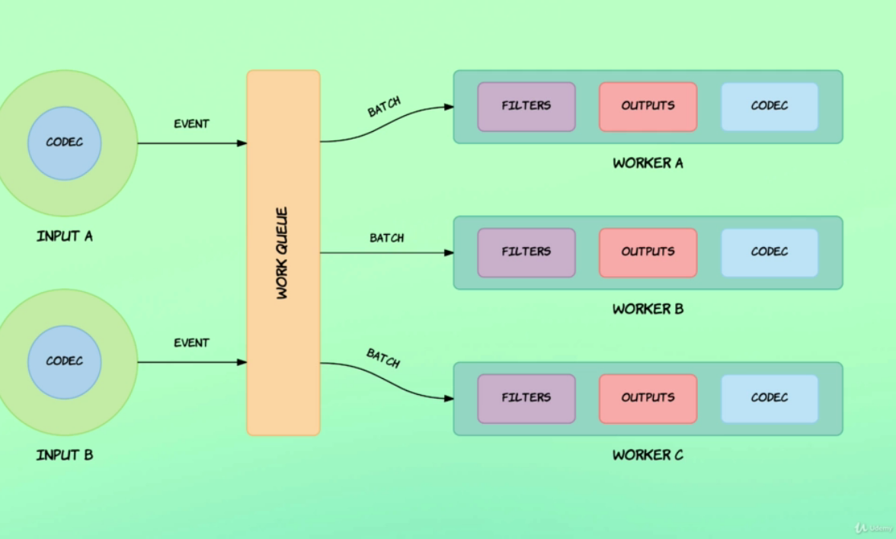

# Logstash Basics

## Defining a Pipeline
---

A pipeline is defining by a configuration following this example:
```bash
#input {
#  <plugin>
#}
#output {
#  <plugin>
#}

input { stdin { } } output { stdout { } }
```

- `Stating Logstash with a configuration file`
```bash
bin/logstash -f ./config/pipelines/pipeline.conf
```

- `Handling Json Input`
```bash
input {
  stdin {
    codec => json
  }
}

output {
  stdout {

  }
}

```

- `Output Events to a File`
```bash
input {
  stdin {
    codec => json  
  }
}

output {
  stdout {

  }
  file {
    path => "output.txt"
  }
}
```

- `Handle HTTP Requests`
```bash
input {
  stdin {
    codec => json  
  }
  http {
    host => "127.0.0.1"
    port => 8080
  }
}

output {
  stdout {

  }
  file {
    path => "output.txt"
  }
}
```

- `Filtering Events`
```bash
input {
  stdin {
    codec => json  
  }
  http {
    host => "127.0.0.1"
    port => 8080
  }
}

filter {
  mutate {
    # converts "quantity" data type to integer
    convert => { "quantity" => "integer" } 
  }
}

output {
  stdout {
    codec => rubydebug
  }
  file {
    path => "output.txt"
  }
}
```

## Mutate Common Filters
---

 

 ```bash
 input {
  stdin {
    codec => json  
  }
  http {
    host => "127.0.0.1"
    port => 8080
  }
}

filter {
  mutate {
    remove_field => ["host". "[headers][connection]"]
  }
}

output {
  stdout {
    codec => rubydebug
  }
  file {
    path => "output.txt"
  }
}

 ```

 ## Execution Model
 ---

 In Logstash each input event runs on its own thread (handled in parallel), avoiding block. After an input is processed it is put in a "work queue" that also process the batch of events in parallel

  

  It is possible to configure two main variables on the `work queue`

  - `batch size` - Max number of events to be processed in a batch. When this number is reached the batch is sent to the next pipeline`s step.

  - `batch delay` - Max allowed time to wait to reach the batch size. If the batch size is not reached in this period, the batch is sent anyway.

## References
---

- [`Input Plugins`](https://www.elastic.co/guide/en/logstash/current/input-plugins.html)

- [`Filter Plugins`](https://www.elastic.co/guide/en/logstash/current/filter-plugins.html)

- [`Output Plugins`](https://www.elastic.co/guide/en/logstash/current/output-plugins.html)