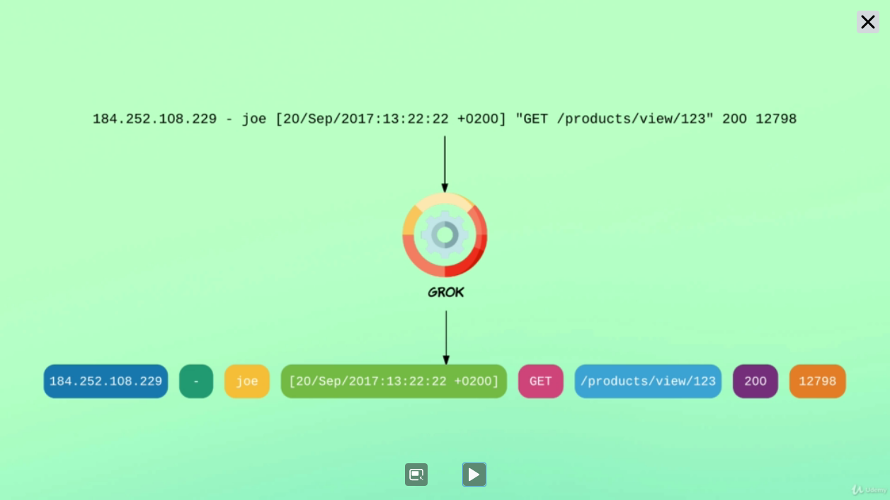

# Manipulating Data

## Passing Requests with Grok
---

  

  

## Accessing Fields
---

  

## Conditional Statements
---

  

  

## Conditional Operators
---

  

## Matching Files (Glob Patterns)
---

  

## Running Multiple Pipelines within one Logstash Intance
---

  

  

## Utils

- [`Grok Patterns`](https://github.com/logstash-plugins/logstash-patterns-core)

- [`Common Options`](https://www.elastic.co/guide/en/logstash/current/plugins-filters-mutate.html#plugins-filters-mutate-common-options) - Supported by all filters

- [`Glob Patterns Support`](https://www.elastic.co/guide/en/logstash/current/glob-support.html)