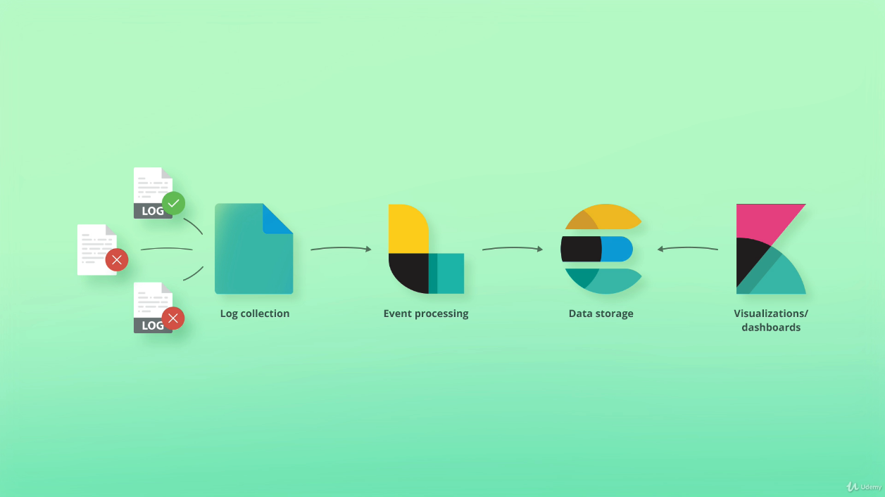
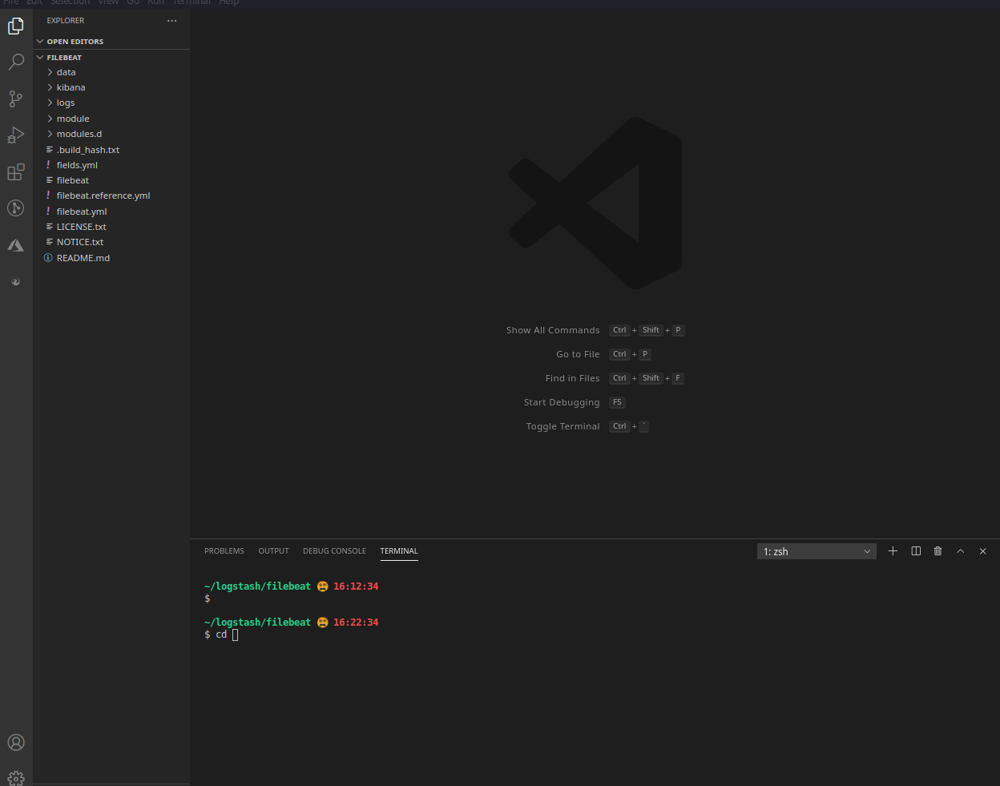
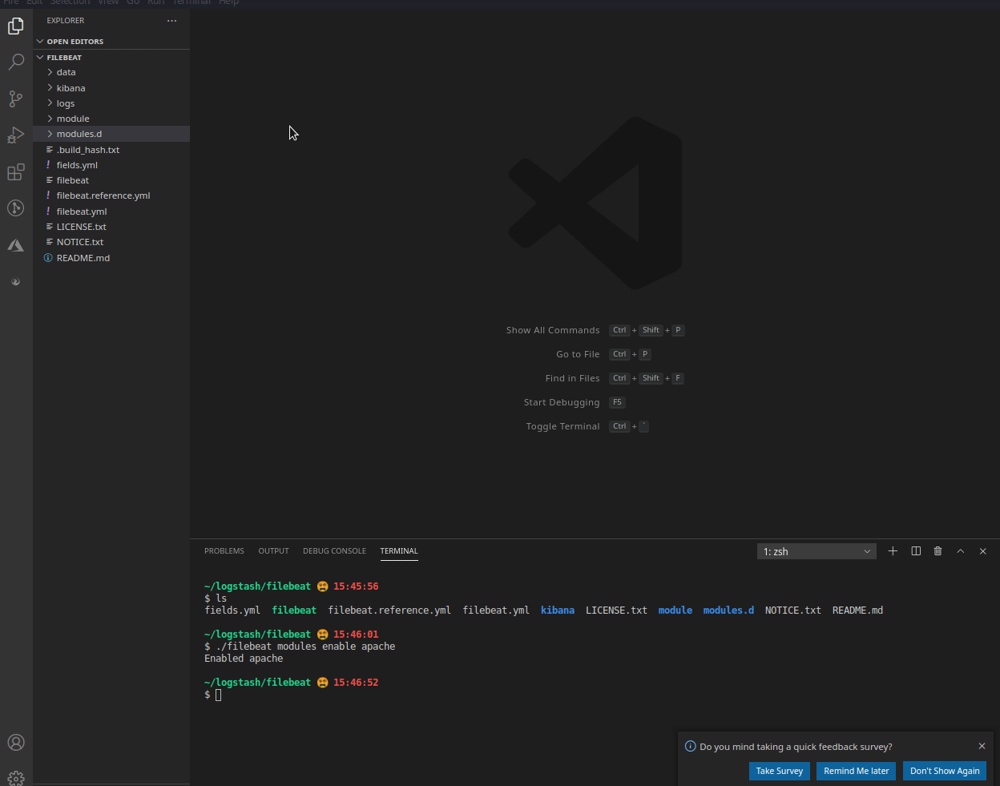
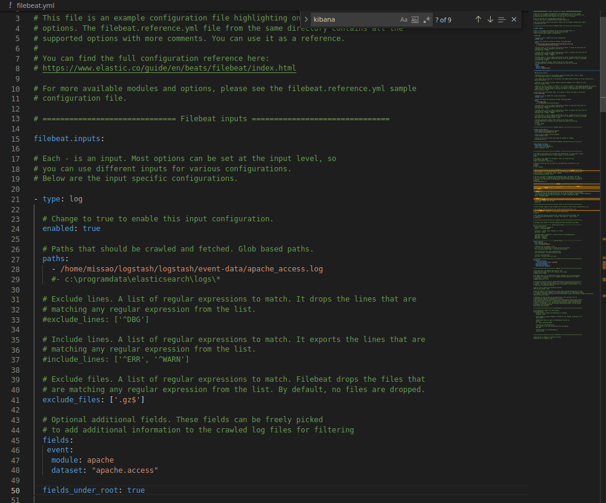

# Beats

Beats is a collection of data shippers, light-weight apps are installed on a server and send data out to a destination. Usually logstash or elasticsearch.

  

  - `Filebeat` - Collects log files.
  - `Metricbeat` - Collects system-level and/or service-level metrics.
  - `Packetbeat` - Collects network data
  - `Winlogbeat` - Collects Windows Events Logs
  - `Auditbeat` - Collects audit data from linux
  - `Heartbeat` - Monitors service uptime

  Example:

  

## Using Filebeat
---

- `Installing`
```bash
wget https://artifacts.elastic.co/downloads/beats/filebeat/filebeat-7.12.1-linux-x86_64.tar.gz

tar -zxf filebeat-7.12.1-linux-x86_64.tar.gz

mv filebeat-7.12.1-linux-x86_64 filebeat
```

- `Configuring Output`
---

  

- `Enabling Module`
---
``` bash
# filebeat modules enable <module-name>
./filebeat modules enable apache
```

- `Customizing Module's Values`
---



- `Setup Logstash Pipeline`
```bash 
input {
  beats {
    port => 5044
    host => "0.0.0.0"
  }
}

output {
  stdout {
    codec => rubydebug {
      metadata => true
    }
  }
} 
```

- `Starting logstash and filebeat`
```bash
# Starting Logstash
./bin/logstash

# Starting Filebeat
./bin/filebeat
```

- `Exporting Filebeat Index Template`
```bash
# Exports Index Template
./filebeat export template > filebeat.template.json

# Loads Indext Template on Elasticsearch
curl -XPUT -H 'Content-Type: application/json' -u <user:password> http://<elastic-search-endpoint>/_template/filebeat-7.12.1 -d@filebeat.template.json

```
- `Exporting Kibana Dashboard`
```bash
# Configure Kibana on the filebeat.yaml
# setup.kibana.host

./filebeat setup --dashboards
```

- `Build Logstash Complete Pipeline`
 
 In most of the cases will be necessary to perform a series of action with the data sent from filebeat, the recommended actions are found on the filebeat file, specfically the ingest.yml pipeline inside the module used. As a result the for the apache module the logstash pipeline will be like this: 

 [LogstashPipeline](./pipelines/filebeat-apache/logstash-pipeline/access.conf)


## Using Filebeat without a Module
---

To use filebeat without using a module is simple, just modify the file `filebeat.yml` under `filebeat.inputs` and the `log` type with the custom values:



## Utils
---

- [Filebeat Inputs Types](https://www.elastic.co/guide/en/beats/filebeat/current/configuration-filebeat-options.html#filebeat-input-types)

- [Converting Ingestion Pipeline to Logstash](https://www.elastic.co/guide/en/logstash/current/ingest-converter.html) 